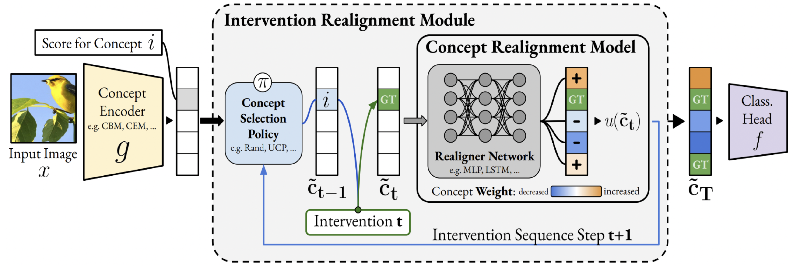

# ECCV 2024: Improving Intervention Efficacy via Concept Realignment in Concept Bottleneck Models
[](https://github.com/mateoespinosa/cem/blob/main/LICENSE) [](https://www.python.org/downloads/release/python-370/) [](https://arxiv.org/abs/2405.01531)





This repository contains the official Pytorch implementation of our paper
[*"Improving Intervention Efficacy via Concept Realignment in Concept Bottleneck Models"*](https://arxiv.org/abs/2405.01531)
accepted at **ECCV 2024**.

This work was done by [Nishad Singhi](https://nishadsinghi.github.io/),
[Jae Myung Kim](https://jaemyung-kim.github.io/),
[Karsten Roth](https://karroth.com),
[Zeynep Akata](https://www.eml-unitue.de/people/zeynep-akata).


# Abstract
Concept Bottleneck Models (CBMs) ground image classification on human-understandable concepts to allow for interpretable model decisions. Crucially, the CBM design inherently allows for human interventions, in which expert users are given the ability to modify potentially misaligned concept choices to influence the decision behavior of the model in an interpretable fashion. However, existing approaches often require numerous human interventions per image to achieve strong performances, posing practical challenges in scenarios where obtaining human feedback is expensive. In this paper, we find that this is noticeably driven by an independent treatment of concepts during intervention, wherein a change of one concept does not influence the use of other ones in the model's final decision. To address this issue, we introduce a trainable concept intervention realignment module, which leverages concept relations to realign concept assignments post-intervention. Across standard, real-world benchmarks, we find that concept realignment can significantly improve intervention efficacy; significantly reducing the number of interventions needed to reach a target classification performance or concept prediction accuracy. In addition, it easily integrates into existing concept-based architectures without requiring changes to the models themselves. This reduced cost of human-model collaboration is crucial to enhancing the feasibility of CBMs in resource-constrained environments.


# Acknowledgements
This repository builds on the Github repository for [Concept Embedding Models](https://github.com/mateoespinosa/cem/tree/mateo/cem_pre_cleanup). We recommend reading their [README](https://github.com/mateoespinosa/cem/blob/mateo/cem_pre_cleanup/README.md).


# Installation
You can locally install this package by first cloning this repository:
```bash
$ git clone https://github.com/ExplainableML/concept_realignment
```
Move into the cloned directory via `cd concept_realignment` \
Set up the conda environment:
```bash
$ conda env create --name CEM --file=conda_environment.yml
```

Then install the `cem` package using:
```bash
$ python setup.py install
```
After running this, you should be able to import the package locally
using
```python
import cem
```


# Experiment Reproducibility

## Downloading the Datasets

In order to be able to properly run our experiments, you will
have to **download** the pre-processed *CUB dataset* found [here](https://worksheets.codalab.org/bundles/0xd013a7ba2e88481bbc07e787f73109f5) to
`cem/data/CUB200/` and the *CelebA dataset* found
[here](https://mmlab.ie.cuhk.edu.hk/projects/CelebA.html) to `cem/data/celeba`.
You may opt to download them to different locations but their paths will have to
be modified in the respective experiment configs (via the `root_dir` parameter)
or via the `DATASET_DIR` environment variable.  


## Running Experiments
The scripts to run experiments are in this directory:
```bash
$ cd concept-realignment-experiments
```

### Step 1: Training the Base CBM/ CEM models
In `train_base_models_and_save_predictions.py`, specify the config file to the model you want to train. The config files are located in `experiments/configs`. After this, run the script as:
```bash
$ python train_base_models_and_save_predictions.py
```
This script trains the base CBM or CEM model, then runs the model on the train and test datasets, and stores its predictions (and some other stuff) in a dictionary. This dictionary is typically saved in `results_dir` in the config file.

### Step 2: Training the Realignment models
Next, we train the model that updates concept predictions after intervention. To do so, specify the relevant paths in `run_optuna.sh`. Then, compile it: 
```bash
$ chmod +x run_optuna.sh
```

Then, run it as:
```bash
$ ./run_optuna.sh <model_name>
```

where `<model_name>` could be `CUB_CEM`, `CUB_IntCEM`, ... 
This script will perform hyperparameter optimization using the `optuna` package, and train the concept realignment model. The trained model is saved in the `checkpoint_save_dir` specified in `concept-realignment-experiments/configs/<dataset>/base.yml`.

### Plot Concept Loss and Accuracy (Figs. 3, 4)
In `concept_loss_vs_num_interventions.py`, specify the path to the predictions from the base model in `predictions_dict_path`, and the path to the concept realignment model in `concept_corrector_path`.
Then, you can run it as:
```bash
$ python3 concept_loss_vs_num_interventions.py
```

### Compare performance on IntCEMs (Fig. 5)
For posthoc realignment, the procedure to train the concept realignment model and generate plots is the same as mentioned above.
For joint training of the concept realignment model and the IntCEM, you can use the appropriate config from `experiments/configs/intcem_configs/<dataset>.yaml`.
Then, you can generate the plots using `intcem_concept_loss_vs_num_interventions.py`. `vanilla_predictions_dict_path` refers to the predictions of the IntCEM model trained without concept realignment, and `predictions_dict_path` refers to the model trained jointly with concept realignment.

### Architecture Ablations (Fig. 6)
First, you need to train the concept realignment models with the different architectures. You can do so by using the appropriate `model_name` in Step 2.
Then, you need to specify paths to the checkpoints of these models in `architecture_ablations.py` and run it.


This script trains the base CBM or CEM model, then runs the model on the train and test datasets, and stores its predictions (and some other stuff) in a dictionary. This dictionary is typically saved in `results_dir` in the config file.

### Coupling Ablations (Fig. 8)
```bash
$ python3 coupling_ablation.py
```


# Citation

If you would like to cite this repository, or the accompanying paper, please
use the following citation:
```
@article{singhi2024improving,
  title={Improving Intervention Efficacy via Concept Realignment in Concept Bottleneck Models},
  author={Singhi, Nishad and Kim, Jae Myung and Roth, Karsten and Akata, Zeynep},
  journal={European Conference on Computer Vision},
  year={2024}
}
```

